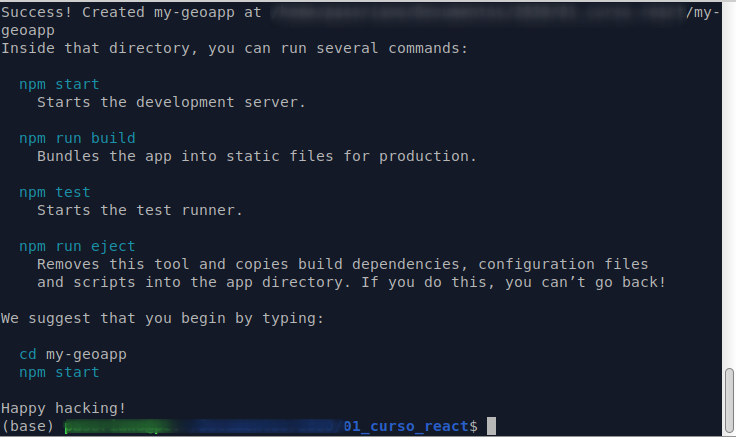

Usamos create-react
```
npx create-react-app my-geoapp
cd my-geoapp
```


Instalamos paquetes

```
npm install react-leaflet leaflet -S
```

Limpiamos la App.js

Creamos carpeta Componnet

Dentro carpeta MapView

Importamos en App.js

import MapView from './components/mapView/MapView_fetch'

CSS

POdemos definir el estilo general en el App.css

.leaflet-container {
    width: 100%;
    height: 100vh;
}

Pasarlo como pro en style

// style={{ height: "480px", width: "100%" }}


