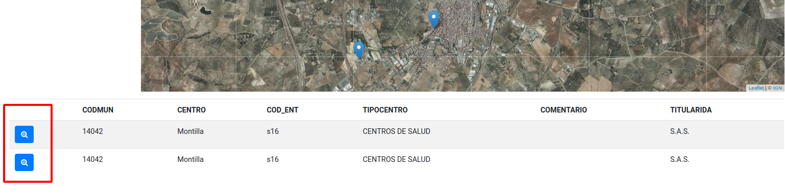

Con la siguiente entrada cierro este *side proyect* que me ha servido para [conocer la libreria React creando una aplicación *web-mapping*](http://www.sigdeletras.com/2020/side-project-desarrollo-de-aplicacion-web-con-react-y-leaflet-i/). Al final de esta entrada está el listado de enlaces que han surgido de todo esto, para quien esté interesado en seguir el hilo.

A modo de **conclusión**, comentar que **estoy contento con la experiecia**. He cumplido con el **objetivo principal** que me marqué que no era otro que el de **introducirme en el uso de React** y he desarrollado la aplicación cubriendo las funcionalidades definidas al principio del proyecto.  

También me gusta la **metodología** que seguido y que creo que aplicaré a aprendizajes futuros. Como en cualquier proyecto de desarrollo real, y con real me refiero proyecto para un cliente, ha sido básico definir correctamente el alcance de las tareas a realizar y marcar un tiempo de ejecución. Esto me ha ayudado a no desviarmente, organizar el tiempo y sobre todo a saber cuándo darlo por terminado. 

Al final, como es normal y conociendo basicamente la librería, me han surgido posibles mejoras, nuevas funcionalidades o ampliaciones, pero como no estaban definidas en mi pila, las dejaré para otro momento.

Quisiera también comentar que **este sistema de autoaprendizaje tiene también su aspecto negativo**. No contar con alguien que te revise el código, que te aporte comentarios o que simplemente te muestre otras vías para mejorar lo aprendido, me deja la sensación en algunas ocasiones de **no saber si he usado la forma más óptima de usar la librería**, aunque el código funcione correctamente.


Este es el listado de las tareas que quedaban por hacer:
- 06 crear componente TableList
- 14 Datos WFS en tabla
- 17 consulta datos en tabla
- 18 conexión mapa-tabla

Los temas aprendidos sobre React a partir del desarrollo de estas tareas son los siguientes:
- Componentes funcionales
- Patrones de diseño para conectar componentes

# Componente TableList

En este último componente vamos a **presentar en formato tabla los resultados obtenidos desde el servicio WFS** de la Junta de Andalucía con datos sobre [equipamintos sanitarios](https://www.juntadeandalucia.es/institutodeestadisticaycartografia/DERA/servicios.htm). Son los mismos datos que usamos para [añadir el GeoJSON al mapa](http://www.sigdeletras.com/2020/side-project-4-react-y-leaflet-wfs/).

Usamos los datos que nos vienen desde sus propiedades y montamos una tabla con cabecera y cuerpo de datos que devuelve la información mediante la función *map()*. El componente *TableList* quedará así.

```javascript
//TablaList
...
export default class TableList extends Component {
  render() {
    const { features } = this.props.data;

    if (!features) {
      return (
        <p className="col-12 text-center mt-4 font-weight-bold">
          Select a municipality from the list. <br /> Then press the Load button
          to view the results
        </p>
      );
    } else {
      return (
        <table className="table table-striped">
          <thead>
            <tr>
              <th> </th>
              <th>CODMUN</th>
              <th>CENTRO</th>
              <th>TIPO CENTRO</th>
              <th>TITULARIDAD</th>
            </tr>
          </thead>
          <tbody>
            {features &&
              features.map((f) => (
                <tr key={f.id}>
                  <td> <ButtonZoom coor={f.geometry.coordinates} /> </td>
                  <td> {f.properties.codmun} </td>
                  <td> {f.properties.centro} </td>
                  <td> {f.properties.tipocentro} </td>
                  <td> {f.properties.titularida} </td>
                </tr>
              ))}
          </tbody>
        </table>
      );
    }
  }
}
...
```

Para futuras mejoras, se debería refactorizar el código y que pudiera servir para cualquier tipo de datos temáticos que se consultaran. 

# Implementando un botón de zum con el patrón de diseño Pub-Sub.

Es interesante añadir un **bótón que permita hacer zum al elemento desde la tabla**. Para obtener una comunicación directa entre componentes, y que ejecute el método *flyTo()* de Leaflet en el compomente *MapView*, he usado el [**patrón de diseño **Observador**](https://es.wikipedia.org/wiki/Observer_(patr%C3%B3n_de_dise%C3%B1o)). Este patrón define una dependencia de uno a muchos entre objetos, de forma que cuando un objeto (sujeto) cambie de estado, se notifique y se actualicen automáticamente todos los objetos (observadores) que depende de él. Esta notificación se realiza normalmente a través de uno de sus métodos. 

El patrón se ha usado para comunicar dos componentes hijos, en este caso *ButtonZoom* que obtiene las coordenadas desde las propiedades de cada fila y *MapView* que es donde se encuentra el evento del zum a las coordenadas pasadas.

Para ser más específicos se ha usado el **patrón Pub-Sub(Publisher-Subscriber)** que añade un evento intermedio. La implementación de este patrón se a realizado gracias a la librería [PubSub](https://www.npmjs.com/package/pubsub-js). En esta [entrada](https://medium.com/@Aida_Pro_/observer-vs-eventbus-patrones-de-dise%C3%B1o-cd8178f48c7d) es donde he obtenido la parte teórica sobre el usos de ambos patrones.

Lo primero que se ha realizado es la instalación de la librería *pubsub-js*  con npm y añadir la importación en los componentes donde los vamos a usar.

```javascript
//TableList.js
import React, { Component } from "react";
import PubSub from "pubsub-js";
...
```
Creamos la función que vamos publicar. La función se denominará *zoomFeature()* y estará dentro del componente de clase *ButtonZoom()*. Este compomente devuelve un botón en cada fila de la tabla con un evento *onClick* que llama a nuestra función. 

```javascript
//TableList.js
class ButtonZoom extends Component {

  zoomFeature = () => {
    PubSub.publish("zoomFromTableRow", this.props.coor);
  };
  
  render() {
    return (
      <button
        ref={this.leafletRef}
        className="btn btn-primary"
        onClick={this.zoomFeature}>
        <i class="fa fa-car"></i>
      </button>
    );
  }
}
```
*ButtonZoom* es usado dentro del componente *TableList* y tiene como propiedades el array de coordenadas del elemento.



Vamos a definir los observadores/suscriptores de nuetro evento. En la aplicación será el compomente *MapView* que es donde podemos usar los métodos de Leaflet gracias al [uso de referencias en React como comentamos en el artículo anterior](http://www.sigdeletras.com/2020/side-project-4-react-y-leaflet-wfs/). La suscripción la hacemos dentro del cliclo de vida *componentDidMount()*. Es importante también eliminar la suscripción ya puede ocurrir fugas de memoria. Esto lo haremos con el método *component WillUnmount()* mediante  *PubSub.unsubscribe*.

```javascript
import React from "react";
import { Map, TileLayer, WMSTileLayer, LayersControl } from "react-leaflet";
import MapLayer from '../MapLayer/MapLayer'
import "leaflet/dist/leaflet.css";
import PubSub from 'pubsub-js'

export default class MapView extends React.Component {
  constructor(props) {
    super(props);
    this.state = {
      geodata: ''
    };
  }

  componentDidMount() {
    PubSub.subscribe('zoomFromTableRow', (e, aCoor) => {
      const leafletMap = this.leafletMap.leafletElement;
      leafletMap.flyTo([aCoor[1], aCoor[0]], 18);
    })
  }

  componentWillUnmount(){
  PubSub.unsubscribe('zoomFromTableRow')
  }
...
```
## GeoApp Final


## Resumen de  tareas realizadas en el Sprint #3


## Hilo de entradas

- [Side Project: Desarrollo de aplicación web con React y Leaflet (I)](http://www.sigdeletras.com/2020/side-project-desarrollo-de-aplicacion-web-con-react-y-leaflet-i/)
- [Side Project: Desarrollo de aplicación web con React y Leaflet (II). Creando componentes](http://www.sigdeletras.com/2020/side-project-desarrollo-de-aplicacion-web-con-react-y-leaflet-ii-components/)
- [Side Project: Desarrollo de aplicación web con React y Leaflet (III). Funciones, estado y props](http://www.sigdeletras.com/2020/side-project-iii/)
- [Side Project: Desarrollo de aplicación web con React y Leaflet (IV). Datos de servicios sanitarios desde WFS](http://www.sigdeletras.com/2020/side-project-4-react-y-leaflet-wfs/)

## Enlaces 

- Repositorio GitHub [React & Maps](https://github.com/sigdeletras/react_maps) (rama *master*)