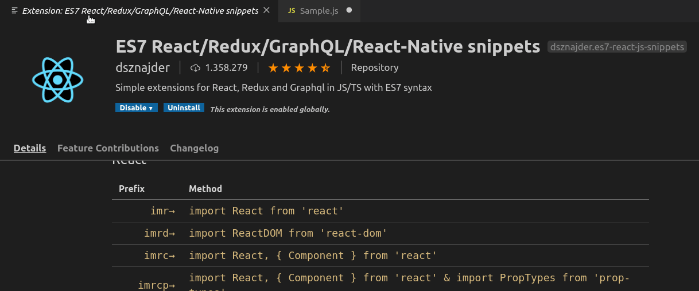
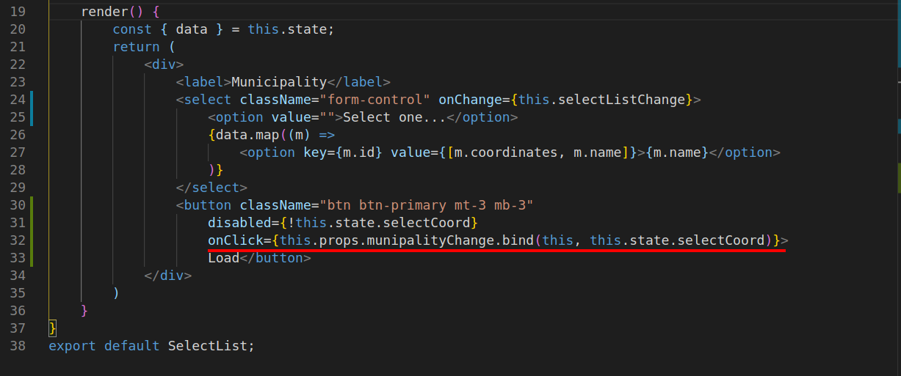
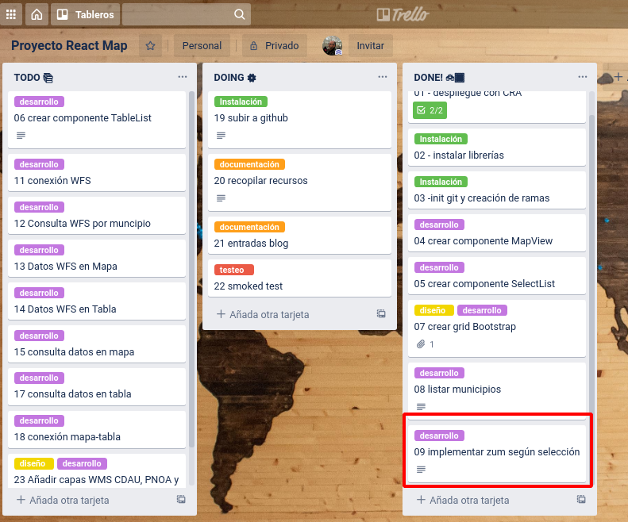

# Sprint 2

En este segundo *sprint* del proyecto que he llamdo [Desarrollo de una aplicación web con React y Leaflet]() la tarea principal ha consistido en desarrollar, mejor dicho **en aprender a desarrollar*, la siguiente historia de usuario:

> *"Como usuario quiero seleccionar un muncipio de un listado de opciones, hacer click en el botón y ver el mapa centrado en el municipioa una escala correcta de visualización"*

La implementación de única tarea me ha servido para adquirir los siguientes conocimientos:

- Dar relevancia a saber dónde desarrollar incluir las funciones de la aplicación dentro del árbol de componentes.
- Cómo establecer la comunicación entre un componente hijo en el componente padre para ejecutar funciones.
- Aprender que se puede pasar funciones a un componente en la sus propiedades.
- Sacarle provecho a los eventos que se lanzan al cambiar un valor de *state*. Para todo esto, la función *this.setState()* de React es clave.
- Ir mejorando el entorno de desarrollo en VSCode con *snippets* para React con la extensión [ES7 React/Redux/GraphQL/React-Native](https://marketplace.visualstudio.com/items?itemName=dsznajder.es7-react-js-snippets). La vida es mucho más fácil con *snippets* 👌	



## Pasando propiedades entre componentes Padre-Hijo

En el código del componente *Mapview* se habían definido los valores por defecto del mapa y el zum (...sí, sí [zum](https://dle.rae.es/zum) según la RAE) inical.

```javascript
//MapView.js
    <Map
        style={styleMap}
        center={[37.885963680860755, -4.774589538574219,]}
        zoom={12}>
```

Ahora vamos a obtener estos datos desde el estado del  componente *App*, pasándolos en las propiedades del hijo cuando sea llamado. Esto va a permitir que, si cambiamos el estado de *App*, se actualice de forma automática el componente *MapView*.

```javascript
// App.js
  {/* Map */}
          <div className="col-sm-8 col-sm-offset-4 col-md-10 col-md-offset-3">
            <MapView coordCenter={this.state.coordCenter} zoom={this.state.zoom}/>
          </div>
```
Y en *MapView*

```javascript
//MapView.js
...
 <Map
        style={styleMap}
        center={this.props.coordCenter}
        zoom={this.props.zoom}>
        <TileLayer
          url="https://{s}.tile.openstreetmap.org/{z}/{x}/{y}.png"
          attribution="&copy; <a href=&quot;http://osm.org/copyright&quot;>OpenStreetMap</a> contributors"
        />
      </Map>
...
```

## Pasando funciones a componentes

Debemos conseguir que, una vez que el usuario elija un municipio y pulse el botón "Load", se actualice el mapa. Respecto a la implementación en el flujo de los componentes React esto se traduciría en:
- Obtener los datos del componente *SelectList* para ser usados en la actualización del estado del *App*.
- Pasar estos datos a la instancia de *MapView* mediante sus *prop*.
- Usar estas propiedades para actualizar su estado (centrado y zum).

### Obtener los datos del componente *SelectList*

Según la [documentación de React](https://reactjs.org/docs/faq-functions.html) *Hay varias maneras de asegurarte que las funciones tengan acceso a los atributos del componente como this.props y this.state, dependiendo de qué tipo de sintaxis"*

Lo primero ha sido crear una nueva función (*munipalityChange*) responsable de actualizar el estado. La función se ha enlazado dentro del constructor.

```javascript
//App.js
...
class App extends React.Component {

  constructor() {
    super()
    this.state = {
      coordCenter: [37.885963680860755, -4.774589538574219],
      munipalityName: '',
      zoom: 9,
    }
    this.munipalityChange = this.munipalityChange.bind(this)
  }

    munipalityChange = (data) => {
    let aData = data.split(',')
    this.setState({
      coordCenter: [aData[0], aData[1]],
      munipalityName: aData[2],
      zoom: 14,
    });
  }
...
```
A continuación, esta función se pasa como propiedad en la instancia *SelectList* que es donde se encuentra el botón que la ejecutará.



Es importante comentar que dentro de este componente, se ha añadido una función que modifica los valores del estado cuando se lanza el evento *onChange()* del elemento *select*.

Una vez salvado cambios ya tendremos disponible esta nueva funcionalidad de nuestra GeoAPP.


## Resumen de <s>tareas realizadas</s> tarea realizada en el Sprint #2



## Hilo de entradas

- [Side Project: Desarrollo de aplicación web con React y Leaflet (I)](http://www.sigdeletras.com/2020/side-project-desarrollo-de-aplicacion-web-con-react-y-leaflet-i/)
- [Side Project: Desarrollo de aplicación web con React y Leaflet (II). Creando componentes](http://www.sigdeletras.com/2020/side-project-desarrollo-de-aplicacion-web-con-react-y-leaflet-ii-components/)

## Enlaces 

- Repositorio GitHub [React & Maps](https://github.com/sigdeletras/react_maps) (rama *master*)