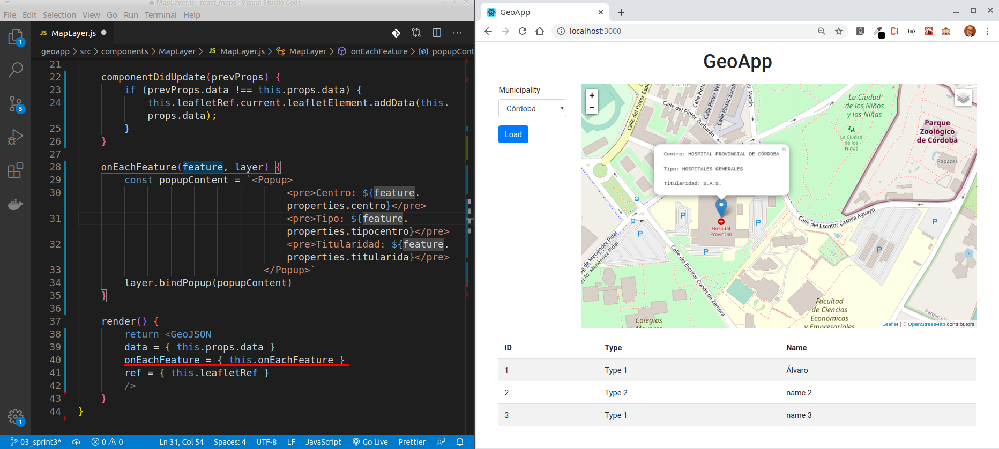
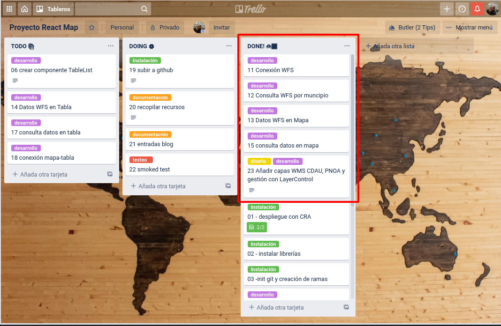

# Sprint 3

Vamos con el tercer *sprint* de este **proyecto para crear una aplicación de mapas con la librería React**. Como vamos comentando desde la primera entrada definimos un conjunto de "tareas" cerradas que definirían el alcance la aplicación. En esta ocasión, le hemos dado un buen impulso a nuestra *backlog*.

Las tareas finalizadas son las siguientes

- 11 Conexión a servicio WFS.
- 12 Consulta WFS por muncipio.
- 13 Datos WFS en Mapa.
- 15 Consulta datos en mapa (popup).
- 23 Añadir capas WMS y gestión con LayerControl.


Centrándome en los temas aprendidos sobre React a partir del desarrollo de estas tareas, los temas vistos son:

- La gestión de forma asíncrona de peticiones/respuestas a servicios WFS usando fetch.
- El uso de referencias y métodos de cliclo de vida en Reat.
- Nuevos componentes de la librería React-Leaflet.

## Petición de datos a un servicio WFS

Dentro del ámbito del acceso a datos geográficos por Internet, se encuentra extendido el consumo mediante servicios OGC. Dentro de estos servicios estándares, el conocido como Web Feature Service (WFS) ofrece una interfaz de comunicación que permite consultar o descargar, y en menor medida editar objetos geográficos. En la la entrada titulada ["Acceso a servicios OGC (WMS,WFS..) con Postman"](http://www.sigdeletras.com/2019/acceso-a-servicios-ogc-con-postman/) tengo desarrollado algunos de estos aspectos.
Hay una gran cantidad de datos que pueden consumirse no solo con un SIG de escritorio, sino también mediante una aplicación web. Sirva come ejemplo la [recopilación de servicios de descargas en la web de la IDE España](https://www.idee.es/es_ES/web/guest/directorio-de-servicios?p_p_id=DIRSRVIDEE_WAR_DIRSRVIDEEportlet_INSTANCE_KXnVu4qMJc1J&p_p_lifecycle=1&p_p_state=normal&p_p_mode=view&p_p_col_id=column-1&p_p_col_count=1&_DIRSRVIDEE_WAR_DIRSRVIDEEportlet_INSTANCE_KXnVu4qMJc1J_descSrv=DESCARGA).

Para el proyecto voy a usar los datos de Servicios de Salud del [WFS de los Datos Espaciales de Rerencia de Andalucía (DERA)](http://www.juntadeandalucia.es/institutodeestadisticaycartografia/DERA/servicios.htm).  En esta capa se encuentran la *"distribución de los equipamientos sanitarios públicos y privados integrados en el Sistema Sanitario Público de Andalucía"*

## Petición de datos con API fetch

En primer lugar hemos añadidos dos nuevos valores en *state* para *App*

```javascript
//App.js
...
export default class App extends React.Component {

  constructor() {
    super()
    this.state = {
      coordCenter: [37.885963680860755, -4.774589538574219],
      munipalityName: '',
      zoom: 9,
      geodata: '',
      code: ''
    }
    this.munipalityChange = this.munipalityChange.bind(this)
  }
...
```
- *geodata*: Será usado para guardar los datos que obtengamos tras realizar la petición al servicio WFS.
- *code*: En este calor se almacenará el código INE del municipio y que permitirá realizar la consulta filtrada el servicio WFS. El código INE ha sido añadido al json que almacena los datos que aparecen en el listad y también se ha actualizado la información almacena en el valor del elemento *select* dentro de *SelectList* para que puede ser usado.


Para la obtención de los datos desde el WFS de la Junta de Andalucía, creamos una función *getWFSData(code)*. En esta función se realizará la petición de datos a la URL del servicio WFS usando [API fetch](https://developer.mozilla.org/es/docs/Web/API/Fetch_API) y pasando el código INE como filtro. La asincronía de la función será manejada con [*async*](https://developer.mozilla.org/es/docs/Web/JavaScript/Referencia/Sentencias/funcion_asincrona)

```javascript
//App.js
...
  async getWFSData(code) {
    const URL = `http://www.ideandalucia.es/dea100/wfs?service=WFS&version=1.1.0&request=GetFeature&typename=dea100:sv03_sas&MAXFEATURES=10&outputFormat=application/json&filter=<Filter><PropertyIsEqualTo><PropertyName>codmun</PropertyName><Literal>${code}</Literal></PropertyIsEqualTo></Filter>&SRSNAME=EPSG:4326`
    const res = await fetch(URL)
    const data = await res.json();
    this.setState({
      geodata: data
    })
  }

  munipalityChange = (data) => {
    let aData = data.split(',')
    this.setState({
      coordCenter: [aData[0], aData[1]],
      munipalityName: aData[2],
      zoom: 14,
      code: aData[3]
    });
    this.getWFSData(aData[3])
  }

  render() {
...
```
Tengo que comentar que ya que estoy trabajando con el servidor de desarrollo que me crea la extensión [create-react-app](https://github.com/facebook/create-react-app) he tenido que solucionar el tema de CORS usando la extensión [Alow CORS](https://chrome.google.com/webstore/detail/allow-cors-access-control/lhobafahddgcelffkeicbaginigeejlf?hl=es) de Chrome.

## Nuevo componente MapLayer para gestionar los datos geográficos

La funcionalidad está desarrollada dentro de un nuevo componente llamado *Maplayer*. Con la librería React-Leaflet tenemos accesible el [componente GeoJSON](https://react-leaflet.js.org/docs/en/components#geojson) que implementa el [código de la API de Leaflet](https://leafletjs.com/reference-1.6.0.html#geojson) la opción de añadir capas de datos vectoriales en este formato.

Para poder usar el icono que viene por defecto en Leaflet he tenido que incorporalo en el compomenente.

![03_icon_lealfet.png][img/03_icon_lealfet.png]

Este componente será usado en *MapView* y usa los datos que le pasamos en sus propiedades

### Ref y ciclos de vida

Despúes de alguna que otra búsqueda [aquí](https://github.com/LiveBy/react-leaflet-choropleth/issues/3) y [aquí](https://github.com/open-austin/austingreenmap/blob/9b0d9ad5ddc245c07c63ab7d2997e74328d73259/client/js/components/ParksMap.jsx), logré conseguir que se cargaran "pintaran" los datos al cambiar del municipio. 

Según la documentación de la librería, alguno de los componentes no se actualizan cuando cambian después de que el componente es montado. Este el el caso del componente GeoJSON. Para que esta opción funciones debemos acceder directamente al elemento Leaflet usado *this.leafletElement* y usando las [referencias de React](https://es.reactjs.org/docs/refs-and-the-dom.html). Gracias a las refencias a terceros accederemos al DOM de Leaflet.

Hechas la referencia, ahora debemos usar las funciones de la librería en los métodos del ciclo de vida del componente:
- componentWillReceiveProps(prevProps). Este método no se ejecutará una vez se monte el componente, si no que se esperará a recibir nuevas props de un componente padre para ejecutarse. Lo usaremos para limpiar las capas si los datos recibidos son distintos.
- componentDidUpdate(prevProps). Es invocado inmediatamente después de que el componente se haya actualizado. Dentro se añadirán los datos para el GeoJSON que obitenemos al realizar la consulta a la API.

```javascript
//MapLayer.js
...
export default class MapLayer extends Component {

    leafletRef = React.createRef();

    componentWillReceiveProps(prevProps) {
        if (prevProps.data !== this.props.data) {
            this.leafletRef.current.leafletElement.clearLayers();
        }
    }

    componentDidUpdate(prevProps) {
        if (prevProps.data !== this.props.data) {
            this.leafletRef.current.leafletElement.addData(this.props.data);
        }
    }
...
```
Para terminar tenemos que pasar como propiedad la referencia creada

```javascript
//MapLayer.js
...
render() {
        return <GeoJSON
        data = { this.props.data }
        ref = { this.leafletRef }
        onEachFeature = { this.onEachFeature }
        />
    }
..
```

### Popups

Terminamos el componente incorporando la función *onEachFeature()* que permite ofrecer información del punto en un *popup*.



## LayerControl

Vamos a darle más funcionalidades a nuestra aplicación de mapas. Para poder ver los datos sobre distintos mapas base, he incorporado el compomente de control de capas *LayersControl* en *MapView*. Dentro del mismo seguimos manteniendo la base de OpenStreetMap y añadimos la ortofotografía del PNOA como capa WMS.

```javascript
    return (
      <div>
        <Map
          style={styleMap}
          center={this.props.coordCenter}
          zoom={this.props.zoom}>

          <LayersControl position="topright">

            <BaseLayer checked name="OpenStreetMap">
              <TileLayer
                attribution='&amp;copy <a href="http://osm.org/copyright">OpenStreetMap</a> contributors'
                url="https://{s}.tile.openstreetmap.org/{z}/{x}/{y}.png"
              />
            </BaseLayer>

            <BaseLayer name="PNOA">
              <WMSTileLayer
                layers={'OI.OrthoimageCoverage'}
                attribution='&copy; <a href="https://pnoa.ign.es/">IGN</a>'
                url="http://www.ign.es/wms-inspire/pnoa-ma?"
              />
            </BaseLayer>

            <Overlay checked name="Servicios Sanitarios (DERA)">
              <MapLayer data={this.props.geodata} />
            </Overlay>

          </LayersControl>

        </Map>
      </div>
    )

  }
```

Tras el desarrollo de las nuevas tareas esta es nuetra aplición web hasta el momento.


## Resumen de  tareas realizadas en el Sprint #3



## Hilo de entradas

- [Side Project: Desarrollo de aplicación web con React y Leaflet (I)](http://www.sigdeletras.com/2020/side-project-desarrollo-de-aplicacion-web-con-react-y-leaflet-i/)
- [Side Project: Desarrollo de aplicación web con React y Leaflet (II). Creando componentes](http://www.sigdeletras.com/2020/side-project-desarrollo-de-aplicacion-web-con-react-y-leaflet-ii-components/)

## Enlaces 

- Repositorio GitHub [React & Maps](https://github.com/sigdeletras/react_maps) (rama *master*)