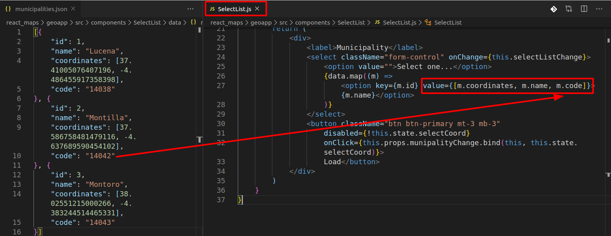

# Sprint 3

Tareas implementadas

- 11 Conexión WFS
- 12 Consulta WFS por muncipio
- 13 Datos WFS en Mapa
- 15 consulta datos en mapa


Conocimientos adquiridos
- ref

## API fetch (ES6)

Petición a un servicio WFS.
Qué son los servicios WFS
Explicación mejor acceso a la entrada
Captura de Postman
CORS complemento

Uso de extensión de Chrome

En primer lugar hemos añadidos dos nuevos valores en *state* para *App*

```javascript
//App.js
...
export default class App extends React.Component {

  constructor() {
    super()
    this.state = {
      coordCenter: [37.885963680860755, -4.774589538574219],
      munipalityName: '',
      zoom: 9,
      geodata: '',
      code: ''
    }
    this.munipalityChange = this.munipalityChange.bind(this)
  }
...
```
- *geodata*: Será usado para guardar los datos que obtengamos tras realizar la petición al servicio WFS.
- *code*: En este calor se almacenará el código INE del municipio y que permitirá realizar la consulta filtrada el servicio WFS. El código INE ha sido añadido al json que almacena los datos que aparecen en el listad y también se ha actualizado la información almacena en el valor del elemento *select* dentro de *SelectList* para que puede ser usado.



Para la obtención de los datos desde el WFS de la Junta de Andalucía, creamos una función *getWFSData(code)*. En esta función se realizará la petición de datos a la URL del servicio WFS usando [API fetch](https://developer.mozilla.org/es/docs/Web/API/Fetch_API) y pasando el código INE como filtro. La asincronía de la función será manejada con [*async*](https://developer.mozilla.org/es/docs/Web/JavaScript/Referencia/Sentencias/funcion_asincrona)

```javascript
//App.js
...
  async getWFSData(code) {
    const URL = `http://www.ideandalucia.es/dea100/wfs?service=WFS&version=1.1.0&request=GetFeature&typename=dea100:sv03_sas&MAXFEATURES=10&outputFormat=application/json&filter=<Filter><PropertyIsEqualTo><PropertyName>codmun</PropertyName><Literal>${code}</Literal></PropertyIsEqualTo></Filter>&SRSNAME=EPSG:4326`
    const res = await fetch(URL)
    const data = await res.json();
    this.setState({
      geodata: data
    })
  }

  munipalityChange = (data) => {
    let aData = data.split(',')
    this.setState({
      coordCenter: [aData[0], aData[1]],
      munipalityName: aData[2],
      zoom: 14,
      code: aData[3]
    });
    this.getWFSData(aData[3])
  }

  render() {
...
```

## Nuevo componente MapLayer para gestionar los datos geográficos


https://github.com/LiveBy/react-leaflet-choropleth/issues/3
https://github.com/open-austin/austingreenmap/blob/9b0d9ad5ddc245c07c63ab7d2997e74328d73259/client/js/components/ParksMap.jsx

La funcionalidad está desarrollada dentro de un nuevo componente llamado *Maplayer*. Con la librería React-Leaflet tenemos accesible el [componente GeoJSON](https://react-leaflet.js.org/docs/en/components#geojson) que implementa el [código de la API de Leaflet](https://leafletjs.com/reference-1.6.0.html#geojson) la opción de añadir capas de datos vectoriales en este formato.

Para poder usar el icono que viene por defecto en Leaflet he tenido que incorporalo en el compomenente.

![03_icon_lealfet.png][img/03_icon_lealfet.png]

Este componente es usado dentro de *MapView* y obteniene los datos desde 

Problemas 

## Ref y ciclos de vida


## Popups

## LayerControl

Nuevas capa WMS

## Resumen de  tareas realizadas en el Sprint #3


## Hilo de entradas

- [Side Project: Desarrollo de aplicación web con React y Leaflet (I)](http://www.sigdeletras.com/2020/side-project-desarrollo-de-aplicacion-web-con-react-y-leaflet-i/)
- [Side Project: Desarrollo de aplicación web con React y Leaflet (II). Creando componentes](http://www.sigdeletras.com/2020/side-project-desarrollo-de-aplicacion-web-con-react-y-leaflet-ii-components/)

## Enlaces 

- Repositorio GitHub [React & Maps](https://github.com/sigdeletras/react_maps) (rama *master*)